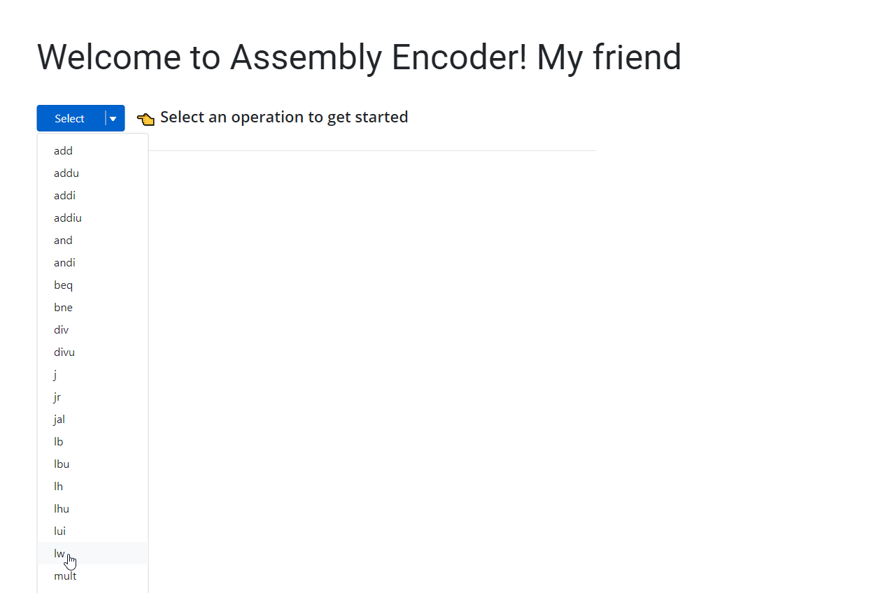
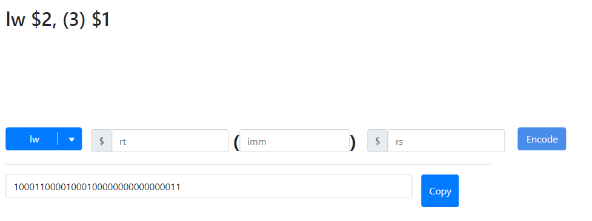

# Assembly Encoder

## About the project
In CS233, you may have a hard time transfering MIPS intructions to machine code. Assmebly Encoder helps you to transfer MIPS intructions in seconds!

## Usage
 

### Example
I will use 'lw $2, 3($1) as an example'
 

### Go to the website
Click the URL: [Assembly Encoder](https://assembly-encoder.vercel.app/). 
You will arrive to the Welcome page.

    

### Select an operation
Click the 'Select' button to choose your desired operation(lw here)

    

### Input values
After select your operation, you will arrive to the page below. Now you can input values. Instruction here is lw $2, 3($1)

       

### Encode
After input values. Click the 'Encode' button to transfer you MIPS instruction to 32-bit function code.

    

### Output
Now you can see your result below the input field and your instruction above. Congrats! You just encode your first MIPS instruction with 'Assembly Encoder'

    

### Copy
Click the 'Copy' button to copy the machine code to your clipboard.

   

# Author
Enxu Han (University of Illinois at Urbana-Champaign)
 
# Special Thanks

## Tester:
Kunping Lin (University of Illinois at Urbana-Champaign)
 
Kary Wang (University of Illinois at Urbana-Champaign)
 
Sicong He (University of Illinois at Urbana-Champaign)
 
Wei Xia (University of Illinois at Urbana-Champaign)
 
Tianshi Zhou (Rensselaer polytechnic institute)
 

## UI and visual supervisor:
Blair Ding (University of the arts London)
